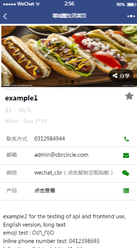
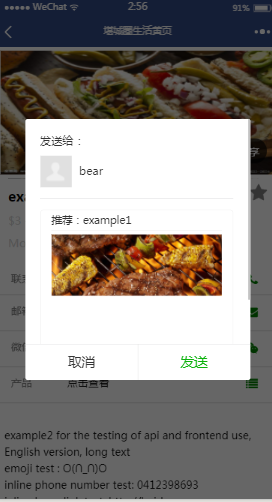

# 同城黄页小程序
## 作者：[CACppuccino](https://github.com/CACppuccino)

由作者历时一个月余进行全栈开发，由于某些原因项目未能作为产品上线，故选择开源前端小程序部分。  
开源本程序旨在用于学习交流，为入门者提供一个完整的项目框架来参考。
## 关于后端 API
大部分 API 仍可供调用，请为大家着想，勿攻击此服务器。敏感部分已经去除，故部分数据无法获取，若仍有敏感数据遗留在项目中，请联系作者，感谢！
## Demo 页面样例

